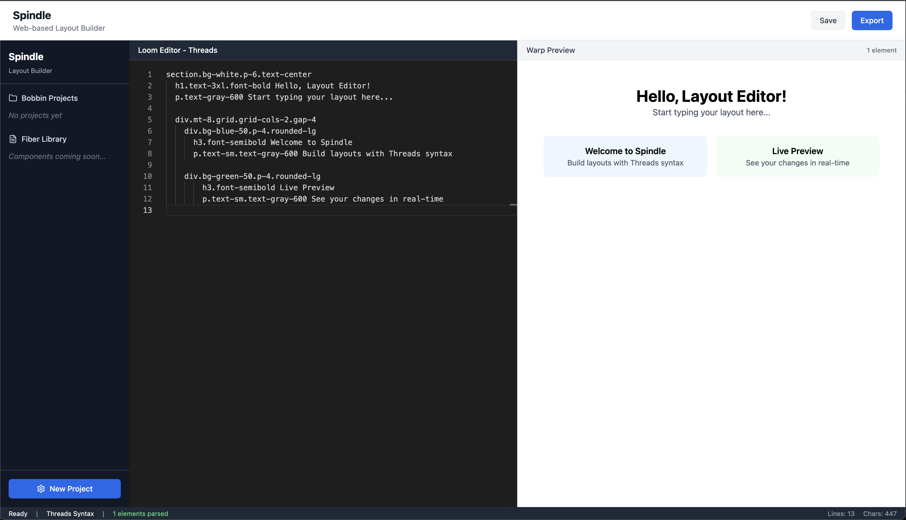

# 🧵 Spindle MVP – Web-Based Layout Builder

**Spindle** is a blazing-fast, web-based layout builder that lets you create responsive components and pages using a lightweight, Pug-inspired syntax called **Threads**. With a real-time editor and instant preview, Spindle drastically speeds up prototyping and UI development.



---

## 🚀 Quick Start

```bash
# Make scripts executable
cd setup/
chmod +x setup.sh scaffold.sh

# Run setup to install dependencies
./setup/setup.sh

# Start the development server
npm run dev
```

---

## 🗂️ Project Structure

```
/src
  /components    → React UI components
  /parser        → Threads DSL parser (coming soon)
  /renderer      → Threads-to-HTML/JSX renderer
  /storage       → Local storage and persistence
  /export        → Export tools (HTML, JSX, etc.)
  App.jsx        → App layout and core logic
  main.jsx       → React entry point
  index.css      → Global styles (Tailwind)
```

---

## ✨ Core Features

| Feature                | Description                                               |
| ---------------------- | --------------------------------------------------------- |
| **🧶 Loom Editor**     | Live Monaco-based editor for writing Threads DSL          |
| **🔤 Threads DSL**     | Minimal markup syntax inspired by Pug, designed for speed |
| **🪞 Warp Preview**    | Real-time visual feedback as you write                    |
| **📚 Fiber Library**   | Easily reuse and compose saved components                 |
| **🧵 Bobbin Projects** | Create, manage, and organize layout projects              |

---

## 🧑‍💻 Development Commands

* `npm run dev` – Start the dev server with hot reload
* `npm run build` – Compile for production
* `npm run preview` – Preview the production build

---

## 🔭 Roadmap / Next Steps

1. Implement Threads DSL parser (In Progress...)
2. Build layout renderer
3. Add component library
4. Create export functionality
5. Add project management


---

## 🛠 Built With

* [React](https://reactjs.org/)
* [Vite](https://vitejs.dev/)
* [Tailwind CSS](https://tailwindcss.com/)
* [Monaco Editor](https://microsoft.github.io/monaco-editor/)

---

## 📄 License

MIT — open and free for use, modification, and commercial projects. See [`LICENSE`](./LICENSE).
